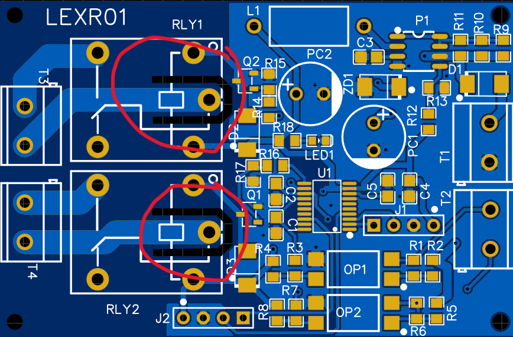

# Push Button Relay Module

A compact relay-based switching module designed for elevator cabin control, managing fan and light functions using an **STM8S003F3P6 microcontroller**. Built with optocoupler isolation, DC-DC power conversion, and a toggle mechanism.

---

## ⚡ Overview

The module handles relay switching for elevator utilities (fan and light) triggered by push-button inputs. Each press toggles the relevant output ON or OFF. The design prioritizes safety through optocoupler isolation between the control circuit and high-power loads, and uses a DC-DC converter to step down 24V to 5V for microcontroller operation.

---

## 🧩 Key Features

- Toggle mechanism — single press turns load ON, next press turns it OFF
- Optocoupler-isolated inputs for protection against voltage spikes
- DC-DC buck converter (MC34063A) steps 24V down to regulated 5V
- SMD LED indicators for fan and light status
- Compact double-layer PCB designed in EasyEDA
- Ready for direct integration into elevator panel

---

## 🔧 Components

| Component | Part Number | Purpose |
|---|---|---|
| Microcontroller | STM8S003F3P6TR | Core logic and relay control |
| Relay (×2) | SRD-05VDC-SL-C | Switch fan and light circuits |
| Optocoupler (×2) | EL817 | Isolate push-button input from MCU |
| DC-DC Converter | MC34063A | Step down 24V → 5V |
| SMD LEDs | — | Visual status indicators |
| Push Buttons | — | User input for fan / light toggle |

### STM8S003F3P6 — Key Specs
- 8-bit STM8 core, Harvard architecture, 3-stage pipeline
- 8 KB Flash, 1 KB RAM, 128 bytes true EEPROM
- 16 MHz clock, 5V operating voltage
- UART, SPI (up to 8 Mbit/s), I²C (up to 400 Kbit/s)
- SWIM single-wire debug interface

### SRD-05VDC-SL-C Relay — Key Specs
- Coil voltage: 5V DC
- Contact rating: 10A at 250V AC / 30V DC
- Terminals: COM, NO (Normally Open), NC (Normally Closed)

---

## 🔄 Toggle Logic

```
System ON
    │
    ├─ Button Press (Fan / Light)
    │       │
    │       ├─ Current state = OFF → Set ON, Activate Relay, LED ON
    │       └─ Current state = ON  → Set OFF, Deactivate Relay, LED OFF
    │
    └─ Loop
```

---

## 📌 STM8 Pin Configuration

| Pin | Function | Description |
|---|---|---|
| VDD | Power Supply | 5V input |
| VSS | Ground | Reference ground |
| PA0 | GPIO / ADC | General-purpose I/O |
| PA1 | GPIO / ADC | General-purpose I/O |
| PA2 | USART TX | Serial transmit |
| PA3 | USART RX | Serial receive |
| PB0 | GPIO | Push-button input (Fan) |
| PB1 | GPIO | Push-button input (Light) |
| PB2 | SPI SS | SPI Slave Select |
| PB3 | SPI MOSI | SPI Master Out |
| PB4 | SPI MISO | SPI Master In |
| PB5 | SPI SCK | SPI Clock |
| NRST | Reset | Hardware reset pin |
| SWIM | Debug | Single Wire Interface for programming |

---

## 🗂️ Repository Structure

```
push-button-relay-module/
│
├── firmware/
│   |── main.c                   # STM8 toggle logic and relay control
|   └── stm8_interrupt_vector.c  # STM8 interrupt vector table (required for build)
│
├── hardware/
│   ├── schematic.pdf            # Full schematic (EasyEDA export)
│   ├── pcb_design.pdf           # PCB layout (EasyEDA export)
│   └── gerber/                  # Gerber files for manufacturing
│       └── *.gbr
│
├── docs/
│   ├── block_diagram.png        # System block diagram (Input → Optocoupler → STM8 → Relay → Load)
│   ├── pcb_2d.png               # 2D PCB render
|   ├── pcb_3d.png               # 3D PCB render
│   └── bom.csv                  # Bill of Materials
│
└── README.md
```

---

## 🖥️ PCB Design Notes

Designed in **EasyEDA** following this process:

1. **Schematic Creation** — All components and logical connections mapped out
2. **Footprint Assignment** — SMD packages selected for compact layout
3. **Routing** — Short traces, 45° angles, minimal vias for signal integrity
4. **DRC & ERC Check** — Design verified for electrical and layout errors
5. **Gerber Export** — Files finalized and ready for manufacturing

The board uses a **double-layer PCB** to keep the footprint small while separating the high-power relay side from the low-power control circuit.



The highlighted regions (marked in the image) show a deliberate **physical gap** between the relay coil driver circuitry (low-voltage control side) and the relay contact traces (high-voltage load side).

Rather than relying solely on the relay package itself for isolation, I extended this separation directly into the PCB layout — creating **creepage and clearance distance** between the two voltage domains. This prevents electrical arcing, protects the microcontroller and gate driver circuitry from transient high-voltage events, and ensures the board meets basic safety expectations for a mains-adjacent design.

What I find elegant about this choice: it costs nothing — no extra components, no added BOM cost — just intentional use of empty board space. The isolation is literally air and FR4. It's one of those decisions that's invisible when it works, but immediately obvious in a post-mortem when it's missing.

The module drives two relays (RLY1, RLY2) via optocoupler-isolated transistor stages (Q1, Q2), with the gap reinforcing the optical isolation already present in the signal path — giving the design two independent layers of protection between the user-facing control logic and the switched load.

---

## 🖥️ Development Environment
 
This project was built using **ST Visual Develop (STVD)** with the **Cosmic STM8 C Compiler**.
 
### Setup
1. Install [STVD](https://www.st.com/en/development-tools/stvd-stm8.html) (ST Visual Develop)
2. Install [Cosmic STM8 Compiler](https://www.cosmicsoftware.com/download_stm8_free.php) (free license available)
3. Clone this repo and open `relay_final.stw` in STVD — **or** create a new STVD workspace and add `main.c` and `stm8_interrupt_vector.c` to it
4. Download the STM8S003 dev board library from
   https://github.com/sonocotta/stm8s003-dev-board
   and add it to your project's include path in STVD
 
### Flashing
Flashing is done via the **SWIM (Single Wire Interface Module)** port using an ST-LINK programmer:
1. Connect ST-LINK to the SWIM header on the PCB
2. In STVD, go to **Debug → Start Debugging** to flash and run, or use **STVP** (ST Visual Programmer) to flash the `.hex` directly
 
---
 
## 🛠️ Built With
 
- [STVD](https://www.st.com/en/development-tools/stvd-stm8.html) — ST Visual Develop IDE
- [Cosmic STM8 Compiler](https://www.cosmicsoftware.com/download_stm8_free.php) — C compiler for STM8
- [EasyEDA](https://easyeda.com/) — Schematic and PCB design
 
---

## 🛠️ Built With

- [EasyEDA](https://easyeda.com/) — Schematic and PCB design
- [VS Code](https://code.visualstudio.com/) + SDCC — Firmware development
- [STM8S003F3P6](https://www.st.com/en/microcontrollers-microprocessors/stm8s003f3.html) — Microcontroller

---

## 👤 Author

**Arya Sureshbhai Patel**   
